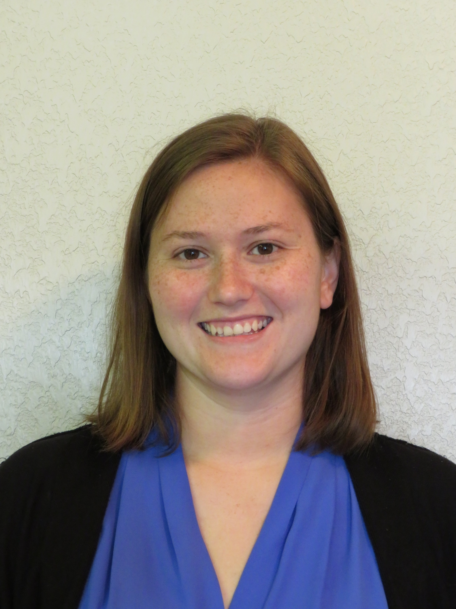

Hi! My name is Sarah Pugachev (formerly Sarah Clayton). I am a digital scholarship specialist at the University of Oklahoma Libraries. In this role, I work faculty, students, and staff who want to learn or expand their digital skills. More specifically, I help with content management systems, introductory computer programming, text analysis, and data visualization. I am also a certified [software carpentry instructor](https://carpentries.org/). For fun, I like to crochet, read, cook, and watch movies. 
